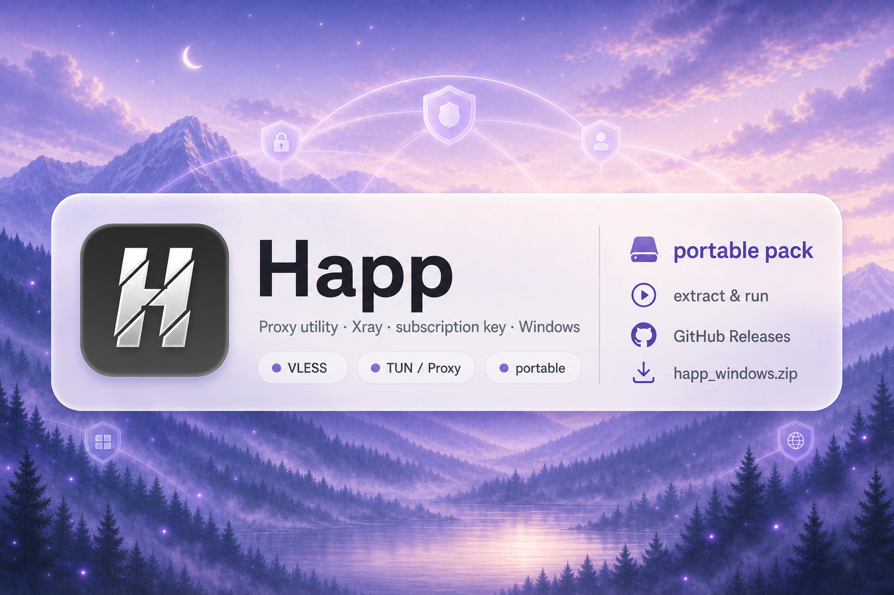
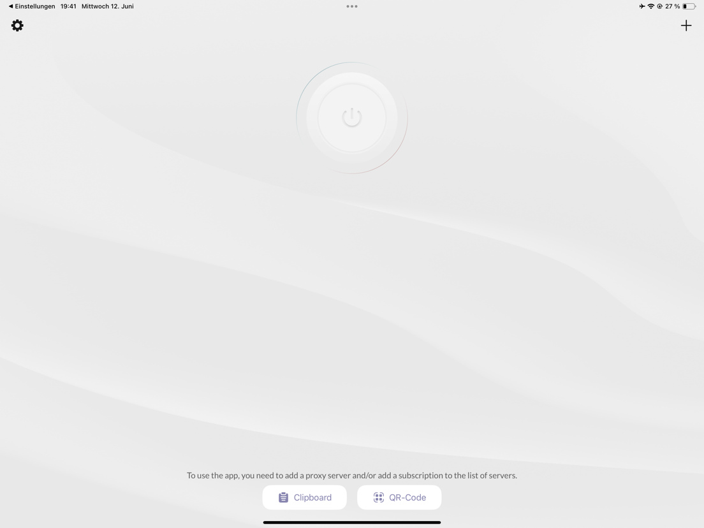
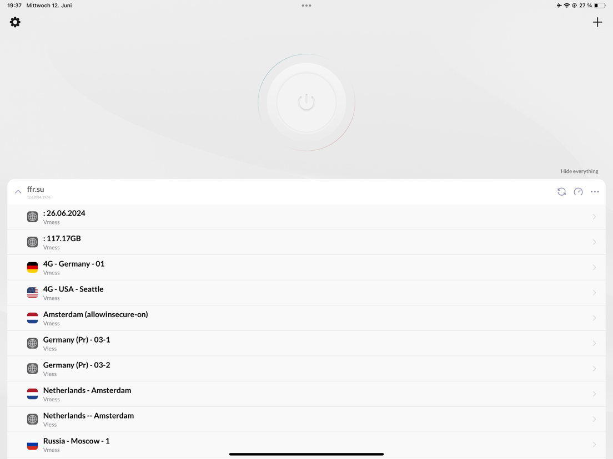

<!-- seo-unique:happ-windows-64:411578cb81 -->

  

  

  <b>Happ — клиент для локальных конфигураций подключения (proxy utility).</b> 
  Xray-core · ключ подписки · TUN или Proxy · Windows x64 · <code>happ_windows.exe</code>

  <a href="./releases/latest"><b>⬇ Releases — скачать happ_windows.zip</b></a>

 

> **Happ не продаёт VPN.** Это открытый **клиент**: вы вставляете свой ключ / подписку.  
> Официальный проект: [Happ-proxy/happ-desktop](https://github.com/Happ-proxy/happ-desktop) · сайт [happ.su](https://www.happ.su/main)

 

  
  &nbsp;
  

 

## Быстрый старт

1. Откройте **[Releases → Latest](./releases/latest)**.
2. Скачайте **`happ_windows.zip`**.
3. Распакуйте и запустите **`happ_windows.exe`** (для TUN лучше от администратора).
4. Если SmartScreen: **Подробнее → Выполнить в любом случае**.
5. Вставьте ключ подписки (буфер / QR) → выберите сервер → подключитесь.
6. Если TUN не встаёт — переключите режим на **Proxy**.

 

## Что умеет Happ

| | |
| :--- | :--- |
| **Xray-core** | VLESS / Reality, VMess, Trojan, Shadowsocks, Hysteria2 |
| **Подписка** | Свой ключ или ссылка — Happ сервера не продаёт |
| **TUN / Proxy** | TUN-драйвер или системный прокси |
| **Windows x64** | Этот пак: **`happ_windows.zip`** → **`happ_windows.exe`** |
| **Приватность** | Конфиги остаются на устройстве |
| **Исходники** | [Happ-proxy/happ-desktop](https://github.com/Happ-proxy/happ-desktop) |

 

## Требования

| | |
| :--- | :--- |
| **ОС** | Windows 10 / 11 (64-bit) |
| **Права** | Администратор для TUN |
| **Ключ** | Своя подписка — в комплекте её нет |

 

## English

**Happ** is a **proxy utility**, not a VPN provider. Paste your own subscription key.

1. **[Releases → Latest](./releases/latest)** → download **`happ_windows.zip`**
2. Extract and run **`happ_windows.exe`**
3. SmartScreen: More info → Run anyway
4. Add subscription → connect (TUN or Proxy)

Official upstream: [Happ-proxy/happ-desktop](https://github.com/Happ-proxy/happ-desktop)

 

## Об этом репозитории

Windows-сборка для GitHub Releases. Баги и обновления клиента — в [upstream](https://github.com/Happ-proxy/happ-desktop/issues).  
Этот репозиторий **не** является официальным аккаунтом Happ-proxy.

 

  happ-windows-64 · #happ-vpn #happ-proxy #happ-client #xray #vless #hysteria

 

> [!NOTE]
> Подробная инструкция: **[DOWNLOAD.md](./DOWNLOAD.md)** · файл **`happ-windows-64.rar`**

<!-- id:c1c4c8cedfc9 -->
